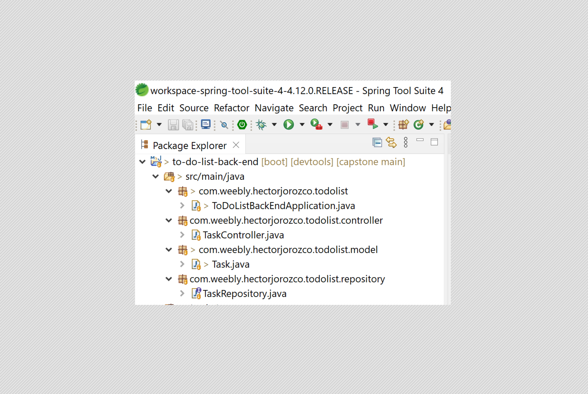
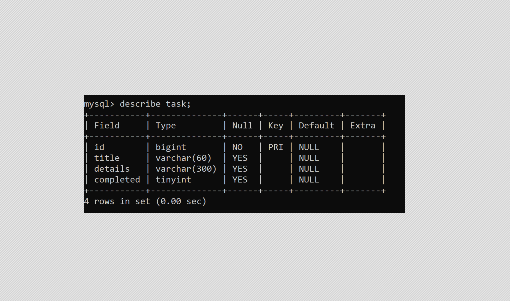

## TO DO LIST Back End 
#### Spring Application and MySQL database.

1. **Java Spring based application** created using Spring Boot on STS (Spring Tool Suite) and hosted locally on an Apache Tomcat server on port 8081 (http://localhost:8081).

The application is made up of the following Java classes and interfaces:

* **ToDoListBackEndApplication** class.

The entry point of the Spring application.

* **Task** class.

The entity that corresponds to a record in the *task* table of the MySQL database.

* **TaskRepository** interface.

A *JPARepository* (Java Persistence API Repository) that contains the methods used by *Hibernate Java Framework* to access and modify the MySQL database.

* **TaskController** class.

    - Defines de EndPoint of the API.
    - Defines the allowed origins for the HTTP requests.
    - Maps the POST, GET, PUT and DELETE HTTP requests to the corresponding EndPoint and *TaskRepository* methods.

2. **MySQL database** hosted locally on MySQL server TCP port 3306 (mysql://localhost:3306)
The MySQL database is named *to_do_list* and it contains one table *task* with the following structure:

All data of the Full Stack application is saved on this database.

---

**Installation instructons**.

If you want to run this Full Stack application you have to perform this Back End installations before installing and running the Front End:

1. Install [MySQL Community](https://dev.mysql.com/downloads/mysql/) and select *Developer installation* during the installation process. Make sure to save your *root* password on a safe place. Once installed, open MySQL command line (it will ask for your *root* password to access it). Then create a database called *to_do_list* and a table called *task* inside of it, with the structure shown on point 2 of this document.

2. Install [Spring Tools 4 for Eclipse](https://spring.io/tools). Once installed, open Spring Tools Suite, create a new *Spring Starter Project* using Maven, Java 11, and the following dependencies:
    - Spring Boot DevTools.
    - Spring Data JPA.
    - MySQL driver.
    - Spring Web. 
    
    Then copy the code on this repository to your Spring application location. Edit the *aplication.properties* file (located on the *resources* folder) and change the password to the one you are using for the *root* user on your MySQL database.

    Run the *Spring application*, and then you are ready to run your *React Application* on the Front End.

