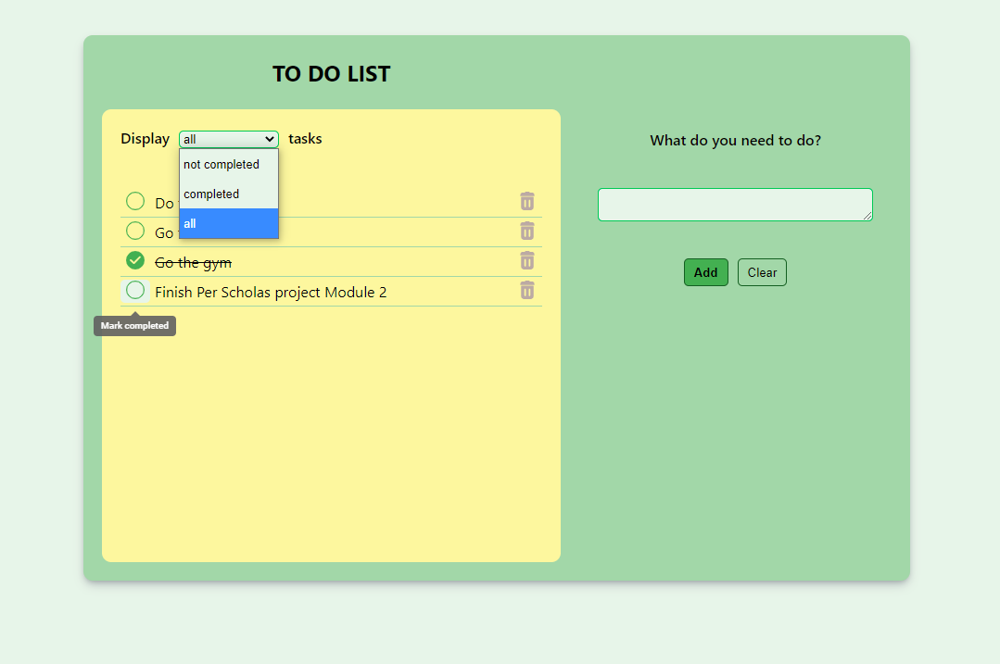

## Mod 2 - Todo List

React functional components.

**INSTRUCTIONS**

Create Todo List Application:

- The app should render a list of items from an array of data stored on a state, using "useState" React hook.
- If the item is not completed, render the item on the page.
- Your app should have an input that allows the user to enter a new item.
- When the user submits the form the value in the input should be added as an item on your to do list. Use an uncontrolled form (useRef React hook) for this. 
- Add a remove button for each item that when clicked removes the item from the list.

Hungry for more:
- Use Local Storage to store your todo list in the browser and retrieve it on page refresh.
- The app should also use conditional styles to cross out the item when it is completed. 

### FINAL PRODUCT ###

#### React functional components hierarchy:
- App
  - ListContainer
    - ListFilter
    - List
  - Form

