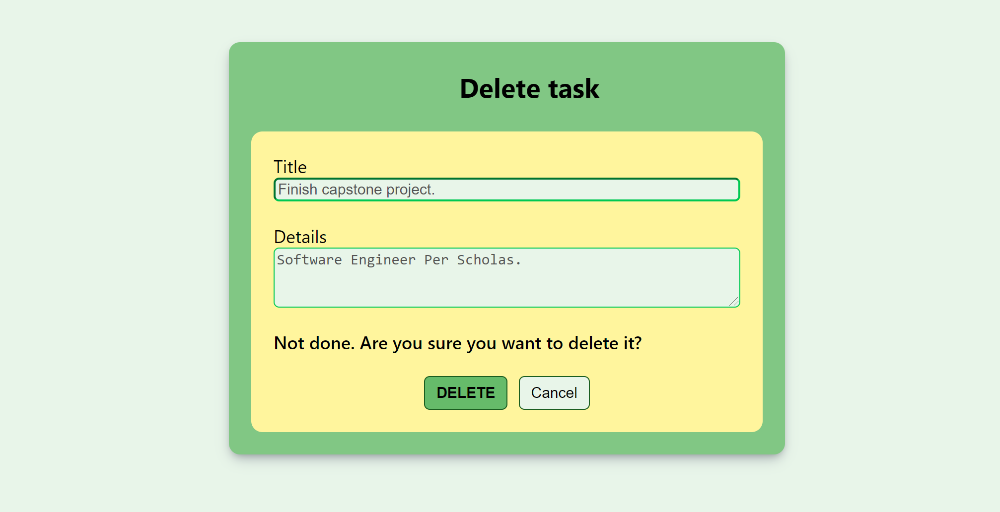

## TO DO LIST Front End
#### React JavaScript app

The application is hosted on a development server when running locally on port 3000 (http://localhost:3000) and is made up of the following React components:

* **App** 

Is the source of truth of the application. It has a state that contains the information of all the tasks of the *To Do List* and a state that contains the task that the user selected to view, edit or delete. When this component mounts it gets tasks data from the MySQL database by sending a GET request to the API hosted on a Tom Cat server deployed by a Spring application. This component will mount only one time during the life of the application, and it ensures that only one GET request is done.

The App component contains routes to other components that will be mounted and unmounted inside of it as the user interacts with the application. It also shows a *Footer* component at its bottom.

* **Tasks** 

It shows the *To Do List* and buttons to let the user perform the *Add*, *View*, *Edit* and *Delete* operations on the list.

The *Tasks* component displays the data that is contained on the *App* state. It contains a *ListContainer* component wich contains a *ListHeader* component in the top (shows the filter option that lets user filter the tasks shown), and *List* component at the bottom (shows the actual list of tasks with some action buttons for each task).

* **AddTask** 

This component is shown when the user clicks on the *Red Plus Icon* located at the top-right corner of the *Tasks* component. 

After entering the task information, when the user clicks the *ADD* button of this component a POST request is sent to the API asking the Spring application to save the task data on the MySQL database. If it succeds, then the task is also added to the state on the *App* component.

* **ViewTask** 

This component is shown when the user clicks on the *Magnifying glass icon* at the right side of a particular task. 

The source of the information that it displays is the *App* component state which saves the information of the task from which the icon was clicked.

* **EditTask** 

This component is shown when the user clicks on the *paper and pencil icon* at the right side of a particular task. 

The source of the information that it displays is the *App* component state which saves the information of the task from which the icon was clicked.

After editing any of the fields, when the user clicks the *UPDATE* button of this component a PUT request is sent to the API asking the Spring application to update the task data on the MySQL database. If it succeds, then the task is also updated on the state on the *App* component.

* **DeleteTask** 

This component is shown when the user clicks on the *trash can icon* at the right side of a particular task. 

The source of the information that it displays is the *App* component state which saves the information of the task from which the icon was clicked.

When the user clicks the *DELETE* button of this component a DELETE request is sent to the API asking the Spring application to delete the task data on the MySQL database. If it succeds, then the task is also deleted on the state on the *App* component.

Finally, the **TaskHttpServices** class contains the *Axios* HTTP request methods used by this React JS application to request and send data to the BackEnd.

___

**Installation instructions:**

Since this application is designed to run locally, to see it in action you will need to run it on your machine.

1. Install [*Node.js*](https://nodejs.org/en/download/).
2. Create a [*React JS*](https://create-react-app.dev/docs/getting-started) application.
3. Install the following packages
    - [Material UI](https://mui.com/)
    - [Axios](https://axios-http.com/docs/intro)
    - [React Router DOM](https://reactrouter.com/web/guides/quick-start)
4. Copy the *Front End* folder code of this repository to your React JS application.
5. Before running the application, make sure that your [*Back End*](https://github.com/hjorozco/to-do-list-full-stack-application/tree/main/to-do-list-back-end) is set up and running.
